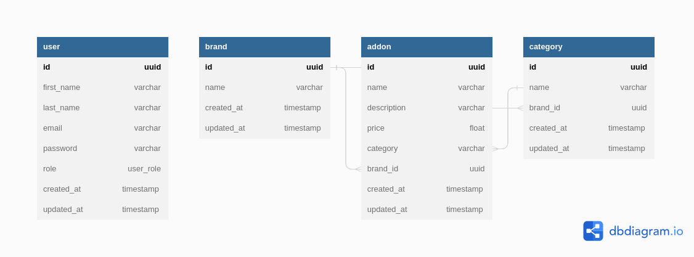

## About 

Meal Management App is a Backend API You are building a backend API for a meal management application that allows users to create, read, update, and delete
meal addons. meal addons. The API also allows users to create categories for these addons.

It has the following functionalities
* A user can create a Base User or Admin account
* A user can create an addon
* A user can retrieve an addon
* A user can retrieve all addons
* A user can update an addon
* A user can delete an addon
* A user can create an addon category

### ER diagram




## Installation

* Clone this repo

  ```bash
  git clone https://github.com/olad5/meal-management-app.git
  ```

* Postman API docs: [Link](https://documenter.getpostman.com/view/19165940/2s8ZDSdRH7)

* Live Link: [Link](https://foodcourt-engineering-assement.onrender.com/)


## Running the project

1. Install and start [Docker](https://docs.docker.com/compose/gettingstarted/) if you haven't already.
2. Copy the `.env` template file. Input the passwords and app secrets. 

```bash
cp .env.sample .env
```

3. Build and run the image to run the Postgresql Database service.

```bash
docker compose up --build
```

4. Run migrations

```bash
  npx knex migrate:latest --knexfile=src/infrastructure/adapter/persistence/knex/knexfile.ts
```

5. Start app

```bash
  npm run start:dev
```


You can visit the app by going to `http://localhost:5300`.


## Run integration tests

```bash
  cp env/sample.test.env  env/.test.env 
  npm run test
```


### Built with

#### Backend

- [Nest js](https://www.nestjs.com/) - Node js Framework
- [Postgresql](https://www.postgresql.org/) - Database
- [Knex js](https://knexjs.org/) - The Query Builder for Node.js
- [Objection js](https://vincit.github.io/objection.js/) - The ORM for Node.js

